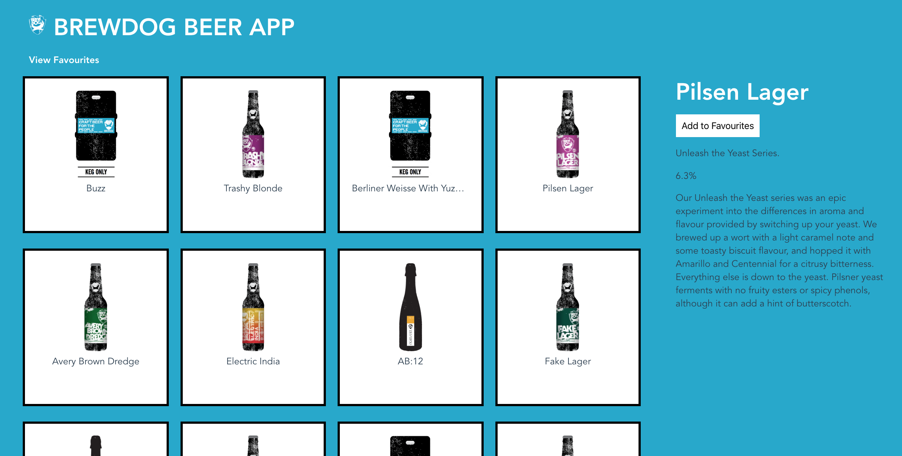
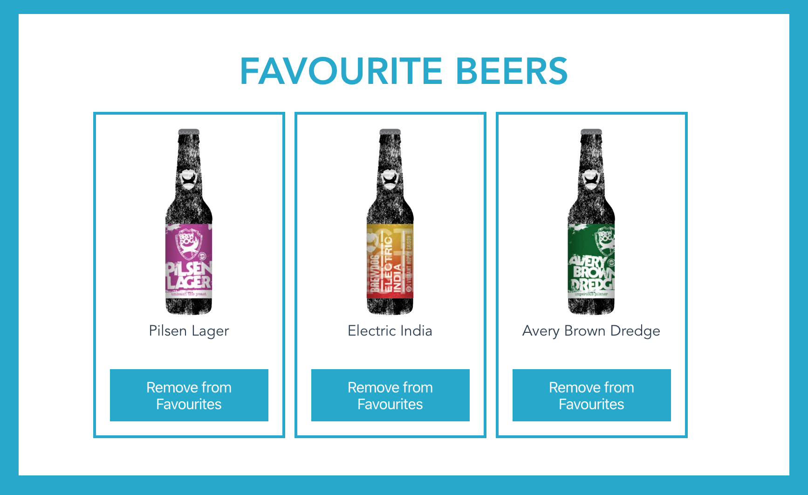

# BrewDog API App

This project was completed during my time studying at CodeClan. The project was a paired lab and the purpose was to practice using an external API, Vue.js and JavaScript. We had 6 hours to work on the project.

Landing Page, Beer Selected:

View Favourite Beers:

## Approach:
- The first thing to check was that we could get a response from the API and see what data we got back. We used Insomnia to see what data we could fetch.
- We had a discussion about what we wanted to achieve and drew some basic wireframes.
- Then we setup a Vue.js project and worked to get the data we wanted displaying on the page.
- Once the basic MVP was in place, I worked on the styling and my teammate did some exploration of returning additional data from the API. We then came together to consolidate our learning and finish off some of the other task extensions including "Allow the user to deselect favourite beers" and "Prevent the user from marking the same beer as a favourite more than once".

## Challenges and Learnings:
- It was a good practice of using Vue.js to dynamically display content, and deciding what data from the API to display, and how to lay it out for the user in a way that was easy for them to consume.
- The API only returned 20 beers at a time, so the extension task involved amending the fetch call on the API to get all of them back.
- The page currently displays all 300+ from the API, so I would like to improve the landing page usability and add pagination to display a certain number at a time.

## The Brief:
Your task is to build an app that uses this API to display information on a variety of beers.
https://punkapi.com/documentation/v2
- Be able to make API requests in a Vue app
- Be able to design a Vue component hierarchy from scratch
- Be able to implement Vue components
This endpoint will provide you with some data detailing multiple beers.

# MVP
Your app should be able to:

- Allow the user to view all the beers
- Allow the user to view more detailed information on a selected beer
- Allow the user to mark beers as 'favourites'
- Display the user's favourite beers

# Extensions
- Prevent the user from marking the same beer as a favourite more than once
- Allow the user to deselect favourite beers
- The endpoint provided will only return 20 beers at a time. Modify your initial request to fetch all 300+ beers the API provides.

## Project setup
Run: npm install
Run: npm run serve
